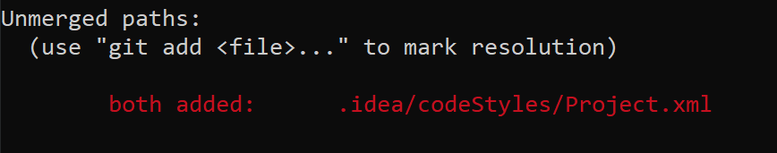

# Basic Git Instructions for on the Command Line

### Working on the right branch
_Before you start working on the project make sure that you are working on the **develop** branch_


| | |
| ------ | ----------------------------------------------- |
|  **1.**  | Open terminal and go to the git repository path   |
| **2.**  |  **git status**
|         | _To check in which branch you are currently. This will most likely be the master branch._  |
| **3.**  |   **git checkout develop**
| | _git checkout will enable you to go to the desired branch._ |


### Before Pushing

|  |  |
| ------ |---------------|
| **1.**  |  **git pull origin develop** |
|   | Will only pull from the develop branch  |
|   | _To see the files/classes that have been modified. In this stage the files will be red since they have not beed added to the git repository yet._  |
| **2.**   |  **git status**
| | _Check which files have been modifies and not added yet. Green means ready to commit, red means you still have to add them._  |
| **3.**   |   **git add .** |
|   | _This will add al the files that have not been added yet, all the files that used to be marked red._  |
| ALTERNATIVELY  | **git add _filename_**   |
|   | _Will only add the once you type in. You will have add the filename you see marked red in git status. So for instance if you see **./idea** in red you type in **git add ./idea**. This can take long is you have a lot of files to add._  |
| **4.**  |  **git commit -m "message"**  |
|   | _Commits the files you just have added._  |
| ALTERNATIVELY   | **git add -am "message"**  |
|   | _This command is **git add *** & **git commit -m "message"** combined. So you can skip the **git add** part._  |
| **6.**  | **git status**  |
|   | _Just to check if nothing is marked red or green. If anything marked red add and commit them. If anything marked green, you still have to commit the files. If there are files or parts you don't want to use anymore, just delete them. Git will still notice this as a modification, so you will still need to add and commit the deleted parts._  |
| **6.**  | **git push origin develop**  |
|   | Will only push to the develop branch  |


### Conflicts

Sometimes when pulling something it will complain that there is a conflict.
You can read in the pull message in which file the conflict arrises.

```
C:\myProjects\Interaction_Design\auroraTest2>git pull
Removing app/src/main/res/font/montserrat_thin.ttf
Removing app/src/main/res/font/montserrat_semi_bold.ttf
Removing app/src/main/res/font/montserrat_italic.ttf
Removing app/src/main/res/font/montserrat_extralight.ttf
Removing app/src/main/res/font/montserrat_bold.ttf
Removing app/src/main/res/font/montserrat.ttf
Auto-merging .idea/codeStyles/Project.xml
CONFLICT (add/add): Merge conflict in .idea/codeStyles/Project.xml
Automatic merge failed; fix conflicts and then commit the result.
```

Alternatively, you can also use **git status** to check where the conflict is. Both added means that there is a conflict somewhere.




If you then go to the file you will see something like this:
```java
<<<<<< HEAD
this.Data = "hello";
=========
this.Data = "Bye";
>>>>>>> SomeNameOrNumber
```

Evertything between <<<<< Head and ======= is what you have modified.
Everything between ======== and >>>>>>> SomeNameOrNumber is what you pulled from the repository. So how you could also read it is like this:

```java
<<<<<< YOURS
this.Data = "hello";
=========
this.Data = "Bye";
>>>>>>> THEIRS
```

What you then want to do is to choose what you want to keep. So for example you want to keep your code then this will be the final result:

```java
this.Data = "hello";
```
