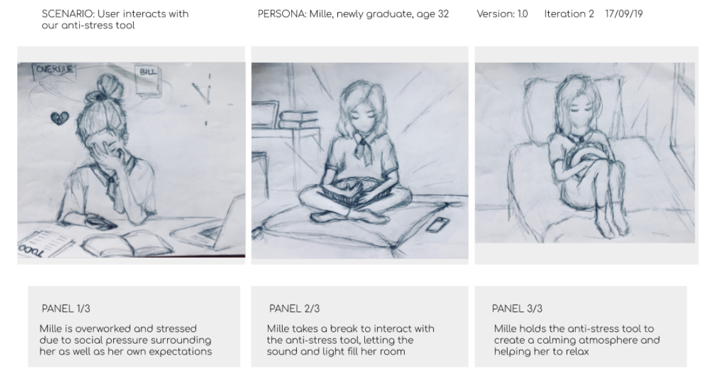

# AURORA
This project is being executed in relation to the course Technical Interaction Design at the IT University of Copenhagen. The objective of this project is to create an android application - AURORA - which connects to a designed lamp. AURORA helps it users to relax with the use of calming lights and sounds.

## Concept

The main goal of AURORA is to reduce the stress of young adults. Various studies have shown that the use of different lights and music at a certain frequency has been successful at influencing people's emotions and state of mind. So rather than developing a meditation app we decided to focus on a physical interactive tool that utilizes light and relaxing sounds to help our potential user relaxed.

An important part in designing the app as well as the lamp is that it should not
enhance extra stress by making it complicated or by giving too many options to choose from. Therefore, we chose to make the design for the app as well as the lamp as simple as possible. For example, we reduced the number of preset themes to two: Forest Mist and Ocean's Echo.

The theme Forest mist plays calming forest sounds and emits lights in various colours of greens and bits of yellow to mimick a walk through the forest.

The theme Ocean's echo plays the sounds of the oceans and emits light in various colours of blue, pruple, and white to mimick the feeling of being in the sea.

Both these themes were chosen to transform a room in a more relaxing environment.

For the ones who prefer a more personalized theme, they can go to the Personal Peace section and choose their colours of preference and connect their music with Spotify.

## Lamp Design
In the image below you can see the first prototype of AURORA. Due to time restrictions and budget resctrictions we kept the design itself as simple as possible for now. We build the shell of the lamp using a laser cutter and drew individuals components using a software tool called Fusion360.

The lamp consists of five elements; the raspberry pi, arduino, LEDs, sensors, and a speaker. The phone communicates to the raspberry pi over bluetooth and the raspberry pi reroutes the received music to its audio jack  which is connected to a speaker. Depending on the received value and music file from the phone, the raspberry pi will initialize serial communication with the arduino and will begin rerouting the audio file to the speaker. The reason for us using two development boards (arduino and raspberry pi) is because we needed to be able to connect over bluetooth and process analog input sensors. Since the raspberry pi is unable to process analog inputs, we had to add an arduino to our product.
The arduino will, at the beginning of its execution, do a calibration run where it measures the values of the sensors and rescales the collected data. Thereafter, the programme starts and the LEDs will light up with the chosen colors. The LEDs are controlled using the PWM pin on the arduino. The LEDs are individually addressable and they can therefore be controlled with only one data line. This setup of individually addressable LEDs allows us to use multiple colors at the same time, and animate the lights with a fluid movement. Giving the users the experience of watching slow moving water.

